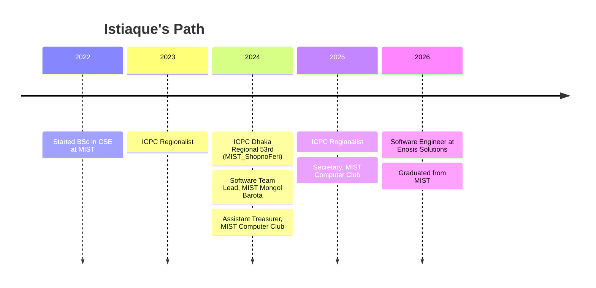

<!-- ==========================================================================
                     ISTIAQUE  AHMED  -  GitHub  Profile  README
     ========================================================================== -->

<a name="top"></a>

<div align="center">


<a href="https://istiaqueahmedarik.vercel.app">
  
</a>

<p>
  <a href="#-about">About</a> &nbsp;&middot;&nbsp;
  <a href="#-tech-stack">Stack</a> &nbsp;&middot;&nbsp;
  <a href="#-featured-projects">Projects</a> &nbsp;&middot;&nbsp;
  <a href="#-journey">Journey</a> &nbsp;&middot;&nbsp;
  <a href="#-achievements">Achievements</a> &nbsp;&middot;&nbsp;
  <a href="#-github-analytics">Analytics</a> &nbsp;&middot;&nbsp;
  <a href="#-lets-connect">Connect</a>
</p>

<p>
  <a href="https://istiaqueahmedarik.vercel.app"></a>
  <a href="https://codeforces.com/profile/"></a>
  <a href="https://github.com/istiaqueahmedarik"></a>
  
</p>


</div>


<a name="-about"></a>

## 🧑‍💻 About Me


```ts
const istiaque = {
  role:      "Software Engineer @ Enosis Solutions",
  education: "BSc in CSE — MIST (2022 — 2026)",
  location:  "Dhaka, Bangladesh 🇧🇩",
  focus:     ["full-stack", "competitive programming",
              "LLMs", "MCP servers", "edge AI"],
  topSkills: ["Problem Solving", "C++", "Web Dev",
              "Python", "Algorithms"],
  motto:     "solve hard problems · ship · help others",
};
```

I'm a hard worker who's always willing to go the extra mile. I'm passionate about
building software and constantly looking for ways to sharpen my craft. I love
cracking hard problems, and I'm a team player who's happiest lifting others up.

- 💼 &nbsp;Software Engineer at **Enosis Solutions**
- 🎓 &nbsp;BSc in Computer Science — **Military Institute of Science and Technology (MIST)**
- 🏅 &nbsp;Three-time **ICPC Regionalist** — 2023 · 2024 · 2025
- ⚡ &nbsp;**Expert** on Codeforces · 2nd @ ARC 24 Final · 14th & 11th @ URC 25/26 Finals
- 🤝 &nbsp;Ex-Secretary **MIST Computer Club** · Software Team Lead **MIST Mongol Barota**
- 🛰️ &nbsp;Exploring **LLMs, MCP servers, and edge AI** on Cloudflare Workers

<br clear="right"/>


<a name="-tech-stack"></a>

## 🛠️ Tech Stack

<table>
  <tr>
    <td align="center" width="25%">
      <b>Languages</b><br/><br/>
      <br/>
      
    </td>
    <td align="center" width="25%">
      <b>Frameworks</b><br/><br/>
      <br/>
      
      
    </td>
    <td align="center" width="25%">
      <b>Data &amp; Cloud</b><br/><br/>
      <br/>
      
    </td>
    <td align="center" width="25%">
      <b>AI &amp; Tooling</b><br/><br/>
      <br/>
      
    </td>
  </tr>
</table>


<a name="-featured-projects"></a>

## 🚀 Featured Projects

<table>
  <tr>
    <td width="50%" valign="top">
      <h3>🩸 <a href="https://lnkd.in/gdaDyBEf">BloodBridge</a></h3>
      <p>Blood-donation platform (SDP-1). Beyond CRUD it packs Gemini OCR,
         semantic search, an MCP server, and Cloudflare Worker AI.</p>
      <p>
        
        
        
      </p>
      <a href="https://lnkd.in/gjeWPHBg">Source</a> &middot; <a href="https://lnkd.in/gdaDyBEf">Demo</a>
    </td>
    <td width="50%" valign="top">
      <h3>📚 <a href="https://lnkd.in/gEcmu3gm">Codebook</a></h3>
      <p>A Java platform for sharing code, where aspiring programmers post
         snippets and learn from one another. Built with Raisul Islam Rahad.</p>
      <p>
        
        
      </p>
      <a href="https://lnkd.in/gEcmu3gm">Source</a>
    </td>
  </tr>
  <tr>
    <td width="50%" valign="top">
      <h3>🔬 <a href="https://vs-community.vercel.app/">Virtual Science Community</a></h3>
      <p>A small organization and blog website for a science community.</p>
      <p>
        
        
      </p>
      <a href="https://vs-community.vercel.app/">Live</a>
    </td>
    <td width="50%" valign="top">
      <h3>🏘️ <a href="https://peer-village.vercel.app/">Peer-Village</a></h3>
      <p>A compact social-media app built with Next.js and Firebase.</p>
      <p>
        
        
      </p>
      <a href="https://peer-village.vercel.app/">Live</a>
    </td>
  </tr>
</table>

<div align="center">
  <sub>📌 Food Daily · an MIST-associated project (Jun 2024 — present)</sub>
</div>


<a name="-journey"></a>

## 🗺️ Journey



**Experience**
- **Software Engineer** · Enosis Solutions (Jun 2026 — Present)
- **Software Team Lead** · MIST Mongol Barota (Feb 2024 — Jun 2026)
- **Secretary** · MIST Computer Club (Jun 2025 — Jun 2026)
- **Assistant Treasurer** · MIST Computer Club (Feb 2024 — Jun 2025)

**Education**
- **BSc in Computer Science** · Military Institute of Science and Technology (2022 — 2026)
- **HSC, Science** · Adamjee Cantonment College (GPA 5.00)
- **SSC** · BAF Shaheen College, Jessore (GPA 5.00)


<a name="-achievements"></a>

## 🏆 Achievements

<table>
  <tr>
    <td valign="top" width="50%">
      <b>Competitive Programming</b>
      <ul>
        <li>🏅 ICPC Regionalist — 2023, 2024, 2025</li>
        <li>📌 ICPC Dhaka Regional 2024 — 53rd (MIST_ShopnoFeri)</li>
        <li>⚡ Expert on Codeforces</li>
        <li>🥈 2nd — ARC 24 Final</li>
        <li>🎗️ 14th — URC 25 Final &middot; 11th — URC 26 Final</li>
      </ul>
    </td>
    <td valign="top" width="50%">
      <b>Leadership</b>
      <ul>
        <li>🤝 Secretary — MIST Computer Club</li>
        <li>💰 Assistant Treasurer — MIST Computer Club</li>
        <li>🚀 Software Team Lead — MIST Mongol Barota</li>
      </ul>
    </td>
  </tr>
</table>

<div align="center">
  
</div>


<a name="-github-analytics"></a>

## 📊 GitHub Analytics

<div align="center">


<br/>


</div>

<!-- Contribution snake (needs a GitHub Action to generate the SVG) -->
<div align="center">
  
</div>


<a name="-lets-connect"></a>

## 🤙 Let's Connect

<div align="center">

<a href="https://istiaqueahmedarik.vercel.app"></a>
<a href="https://github.com/istiaqueahmedarik"></a>
<a href="https://codeforces.com/profile/"></a>


<br/><br/>

<i>"Solve hard problems, ship, and help others along the way."</i>

</div>


<div align="center"><a href="#top">⬆️ Back to top</a></div>